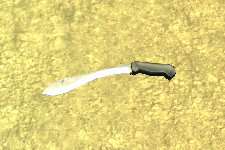
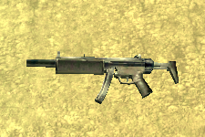

# Far Cry: Introduction to Data Science – Entity Relationship Diagram (ERD)


## Introduction

[Far Cry is a first-person shooter (FPS) video game](https://www.youtube.com/watch?v=Cz3vGM08S7Q&has_verified=1) with amazing graphics, developed by Crytek and published by Ubisoft. The game was released in 2004 for Microsoft Windows and was a huge commercial success. Ubisoft closed the online servers almost 12 years later.

Far Cry features several [multiplayer modes](https://www.youtube.com/watch?v=GaFM0uWAzh0) in which players basically score points by killing other players. One of these multiplayer modes is deathmatch, also known as free for all (FFA), where the goal is to kill (or frag, from the military term) as many other players as possible within a limited period of time. Basically, everything that moves SHOULD be killed… :)

### Multiplayer FFA Session

Players can join an online multiplayer session by connecting to a Far Cry server. A session starts for a configurable limited period of time, for example: 30 minutes, during which each player tries their best to seek out and kill other players.

When the limited period of time expires, the game stops and it displays the results of the match as an ordered leaderboard with the number of kills and deaths per player, and the efficiency of each player:


### Weapons

Players have access to a large arsenal of real-world weapons in Far Cry, from grenades and pistols, to rocket launchers, machines guns and sniper rifles. Check out [all of the weapons from good old Far Cry](https://www.youtube.com/watch?v=vzNG4VlCTFM)! They sound so cool!

| Name                                              | Code                                                  | Photo                                                  |
| ------------------------------------------------- | ----------------------------------------------------- | ------------------------------------------------------ |
| Machete                                           | `Machete`                                             |                      |
| Jungle Falcon                                     | `Falcon`                                              |                |
| Jackhammer Shotgun                                | `Shotgun`                                             |           |
| P90 SMG                                           | `P90`                                                 |                      |
| MP5 SMG                                           | `MP5`                                                 |                      |
| M4 Carbine                                        | `M4`                                                  |                   |
| AG36 Assault Rifle                                | `AG36` for the rifle, `AG36Grenade` for the explosive |           |
| OICW Advanced Assault Rifle                       | `OICW` for the rifle, `OICWGrenade` for the explosive |  |
| AW50 Sniper Rifle                                 | `SniperRifle`                                         |            |
| M249 SAW MG                                       | `M249`                                                |                  |
| Rocket Launcher                                   | `Rocket`                                              |              |
| Grenade                                           | `HandGrenade`                                         |                  |
| Mk.19 Mounted Mortar Launcher Platform            | `StickyExplosive`                                     |                       |
| Patrol Boat (when a player runs over another)     | `Boat`                                                |                 |
| Humvee or Buggy (when a player runs over another) | `Vehicle`                                             |                       |
| Rocket Launcher mounted on a vehicle              | `VehicleMountedRocketMG`                              |                      |
| Mounted Minigun                                   | `VehicleMountedAutoMG`, `MG`                          |               |
| Machine Gun mounted on a vehicle                  | `VehicleMountedMG`                                    |                       |
| Rocket Launcher mounted on a vehicle              | `VehicleRocket`                                       |                      |

_Note: AG36 Assault Rifle and OICW Advanced Assault Rifle weapons have two fire modes: automatic rifle and grenade launcher._

### Server Log: Frag History

The Far Cry server stores [log information in a text file](logs/log00.txt), starting with engine and system initialization data, followed by all the frags that occurred in every match sessions.

For example:

```bash
$ cat ./logs/log00.txt | grep killed | head
<26:32> <Lua> papazark killed lamonthe with AG36
<27:07> <Lua> theprophete killed lamonthe with Rocket
<27:18> <Lua> theprophete killed lamonthe with Rocket
<27:29> <Lua> theprophete killed lamonthe with Rocket
<27:47> <Lua> theprophete killed lamonthe with Rocket
<28:10> <Lua> theprophete killed papazark with Rocket
<28:49> <Lua> theprophete killed papazark with Rocket
<29:28> <Lua> papazark killed lamonthe with AG36
<29:36> <Lua> papazark killed lamonthe with AG36
<30:07> <Lua> theprophete killed papazark with SniperRifle
```

The format of a line corresponding to a frag, when a player kills another player, is:

```text
<MM:SS:> <Lua> killer_username killed victim_username with weapon_code
```

or the following format, when a player kills himself, e.g., when a stupid player miserably dies by throwing a grenade that eventually explodes at their feet...

```text
<MM:SS:> <Lua> killer_username killed itself
```

where:

- `MM`: Zero-padded minute between 00 and 59 of the time when the frag occurred;
- `SS`: Zero-padded second between 00 and 59 of the time when the frag occurred;
- `killer_username`: Username of the player who fragged another; can only contain letters, numbers, dashes ("`-`"), periods ("`.`"), and underscores (`_`);
- `victim_username`: Username of the player who has been fragged;
- `weapon_code`: Code name of the weapon that was used to frag the other player.

_Note: The time of a frag is relative to the time the Far Cry engine started. It represents the number of minutes/seconds elapsed between the moment the game engine started and when the frags occurred._

_Note: Players who joined a match but who hid during all the match, meaning they didn't kill anyone and they haven't been killed by anyone, don't appear in the frag history at all. We just ignore them._

You can download [Far Cry 1.34 on Windows](https://drive.google.com/file/d/1pQ5RFuQ3t669KXd_jV-2KoOONdT6NcY8/view?usp=sharing), [unzip](https://www.7-zip.org/) the archive on the disk of your computer, and run the executable `./Bin32/FarCry.exe`.


## Waypoint 1: Design a First Naive Data Model

### Introduction to Data Model

We want to keep every frag history of our Far Cry game sessions. If we were continuing to use Google Sheets, we would have to create as many sheets as we play Far Cry multiplayer game sessions. It would be kind of unmanageable in Google Sheets.

We would prefer to store frag history and their respective match statistics in a persistent storage that we could then easily query to display information. This is what a [database](https://en.wikipedia.org/wiki/Database) is for. A **database** could be compared to a **spreadsheet**. It's basically a container.

A **sheet** in a database is called a **table**. It works almost the same. The only difference is that you need to name each column. You can also precisely define the type of each column (text, number, etc.), while Google Sheets simply guesses (but sometimes it's incorrect).

A **row** in a sheet is called a **record** in a table.

Also, you may already be more or less aware that there are some kinds of dependencies, also known as **relationships**, between the data. For instance, the frags are related to a match, the same applies to the statistics.

The software application that enable users to manage such databases are called [relational database management systems (RDBMS)](https://en.wikipedia.org/wiki/Relational_database_management_system). There are many RDBMS.

The simplest is [SQlite](https://www.sqlite.org). SQLite is built into a majority of smartphones and most computers and comes bundled inside countless other applications that people use every day.

[PostgreSQL](https://www.postgresql.org/) is a powerful, open source object-relational database system with over 30 years of active development that has earned it a strong reputation for reliability, feature robustness, and performance.

### Entity Relationship Diagram (ERD)

Before we store data into an RDBMS, we need to design the data model. Such a design corresponds to an [Entity Relationship Diagram (ERD)](https://www.lucidchart.com/pages/er-diagrams) that illustrates how entities relate to each other within a system.

ER models are typically drawn up to [three levels of detail](https://www.guru99.com/data-modelling-conceptual-logical.html): [**conceptual data model**, **logical data model**, and **physical data model**](https://www.visual-paradigm.com/support/documents/vpuserguide/3563/3564/85378_conceptual,l.html).

### Logical Data Model

Even if major RDBMS follow most of the database standards, there are always [some differences](https://www.sql-workbench.eu/dbms_comparison.html). For instance the data type, which defines the type of value that can be stored in a table column, can differ from one RDBMS to another.

When you design a data model, you want to describe the data in as much detail as possible: the entities, their attributes and their relationships, without regard to how they will be physical implemented in an RDBMS. This is the [logical data model](https://www.omg.org/retail-depository/arts-odm-73/logical_data_model_concepts.htm).

This enables you to select (at a later stage) an RDBMS into which the data model can be implemented. A logical data model can be more or less automatically converted to a physical data model with the help of tool.

To translate Google sheets into entities is damn simple. The sheets `Frag History` and `Match Statistics` can be converted into two entities `match_frag` and `match_statistics`:


There are many [data modeling tools](https://en.wikipedia.org/wiki/Comparison_of_data_modeling_tools). Not all of them are free and not all of them run on Linux. We chose
[Navicat Data Modeler](https://www.navicat.com/en/products/navicat-data-modeler) it is free and runs on Linux, but which essentials version is quite limited.

Create a new logical diagram, also known as an [Entity-Relationship Diagram](https://www.smartdraw.com/entity-relationship-diagram/) and design the two entities `match_frag` and `match_statistics`:

| Frag History Entity Design                                | Match Statistics Entity Design                                  |
| --------------------------------------------------------- | --------------------------------------------------------------- |
|  |  |

_Note 1: We prefer to use our own abstract data type `datetime`, `string`, `integer`, and `decimal`, rather than the data types the application Navicat suggests, which seem more specific to a particular RDBMS._

_Note 2: The attributes `frag_time` and `killer_name` of the table `match_frag` always contain a value. For example: they CANNOT be null, while the attributes `victim_name` and `weapon_code` can be empty, they CAN be null (e.g., when the player committed suicide). What about the table `match_statistics`?_

## Waypoint 2: Add Match Entity

However, we have an issue with our current data model: how does this model allow us to distinguish frags from distinct game sessions? We need a way to tag frags with the game session they belong to.

We need to add a new entity `match` with the following attributes:

- `match_id`: [identity attribute](https://en.wikipedia.org/wiki/Identity_column) of this match;
- `start_time`: the time the match started;
- `end_time`: the time the match ended;
- `game_mode`: the multiplayer mode that was played;
- `map_name`: the name of the map that was played.


Where does this match identifier come from?! The Far Cry engine doesn't log any game session identifier! This is a detail of implementation that we will solve later with the physical data model.

For now, simply create this entity `match` as follows:


## Waypoint 3: Add Match Identifier to Match Frag Entity

Modify the entity `match_frag` to add an attribute `match_id` with the data type `integer`. Each frag will be tagged with the unique identifier of the match this frag belongs to. We now have a way to distinguish frags from distinct game sessions.


## Waypoint 4: Add Match Frag and Match Entities Relationship

The entity `match` provides general information about a game session, while the entity `match_frag` provides information about each individual frag that occurs during this game session.

There is a relationship between these two entities. They are linked together with the identity of a match. The entity `match` is the _parent_ entity, while the entity `match_frag` is a _child_ entity. The entity `match_frag` refers to the entity `match`.

Select the entity `match_frag` and add a new relation with the name `fk_match_frag_match_id`, selecting the source attribute `match_id`, and selecting the destination entity `match` and attribute `match_id`.

We use the naming convention `fk_(entity_name)_(attribute_name)`, where `entity_name` and `attribute_name` correspond to the source entity and attribute; `fk` stands for _foreign key_.

| Relationship Edition                                                                                    | Relationship Diagram                                                                            |
| ------------------------------------------------------------------------------------------------------- | ----------------------------------------------------------------------------------------------- |
|  |  |

Solid lines that connect attributes show the relationships of entities in the diagram.

## Waypoint 5: Define Degrees of Relationship

The degree of relationship (also known as _cardinality_) is the number of occurrences in one entity which are [associated or linked](https://www.visual-paradigm.com/guide/uml-unified-modeling-language/uml-aggregation-vs-composition/) to the number of occurrences in another.

_Ordinality_ describes the relationship as either mandatory or optional. It is the minimum number of occurrences an instance in one entity can be associated with an instance in the related entity.

[Cardinality and ordinality](https://www.youtube.com/watch?v=QpdhBUYk7Kk) are shown by the styling of a line and its endpoint, according to a notation style such as the [Crow's foot notation](https://www.vertabelo.com/blog/technical-articles/crow-s-foot-notation):


Let's consider match and frag entities:

- There can be zero or many frags during a match, meaning that a match can be linked to zero or many frags;
- A frag is linked to one and only one match.

Select the solid line that represents the relationship between the two entities `match` and `match_frag`, and edit the cardinality of their endpoints.


## Waypoint 6: Add Match Statistics and Match Entities Relationship

Repeat the same modifications for the entity `match_statistics` that also reference the entity `match`.

The final database diagram should looks like the following:


We have completed the design of our Far Cry data model! Entity-relationship diagrams are very important in the documentation of an information system. You should always start designing the data model of the information system you want to implement, instead of directly creating database objects in your RDBMS.

We should convert the logical data model to a physical data model for a given RDBMS. This physical data model can be used to generate [DDL statements](https://en.wikipedia.org/wiki/Data_definition_language) which can then be deployed to a database server.

However, for practical reasons, we are going to manually create, in the next mission, database objects directly in our RDBMS, starting with SQLite, based on the logical data model we have just designed.
